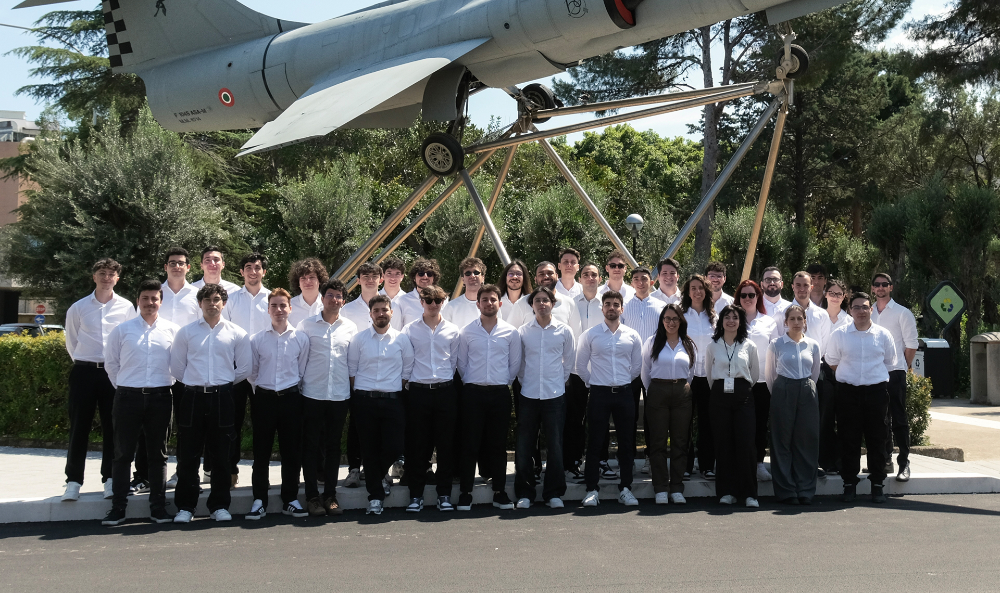

# Apex Corse IT Team

  
  

  
  
  

---

## Chi Siamo?

Apex Corse è la scuderia dell’Università di Palermo che nasce nel 2023 con lo scopo di progettare e produrre auto da corsa destinate a competere nel campionato internazionale della Formula SAE (Society of Automotive Engineers) contro le migliori università di tutto il mondo.

---

## LA COMPETIZIONE

La Formula SAE, fondata nel 1981 dalla Society of Automotive Engineers, è una competizione internazionale che coinvolge le università e i loro studenti nella creazione di squadre finalizzate alla progettazione di piccole monoposto e la loro valutazione a 360 gradi tramite sfide in pista e non.

---

## TEAM IT

Il team IT è responsabile della progettazione, implementazione e manutenzione dell’infrastruttura informatica del team. Tra le principali attività rientrano la gestione della rete interna, l'amministrazione del sistema NAS per l’archiviazione centralizzata dei dati, la gestione delle licenze software e lo sviluppo di strumenti digitali personalizzati. Inoltre, il team cura l’integrazione di soluzioni automatizzate, come bot Telegram, e contribuisce allo sviluppo di software per l’acquisizione e l’analisi dei dati, supportando operativamente tutti gli altri reparti.

---

## I nostri progetti

- [Volante del veicolo](https://github.com/ApexCorse/steering-wheel)  
- [DataLogger per la telemetria del veicolo](https://github.com/ApexCorse/ephoros)  
- [VERA - Generatore di codice C per file CAN DBC](https://github.com/ApexCorse/vera)  
- [KING - Bot multi-funzione per Apex Corse](https://github.com/ApexCorse/king)  
- [Sito web ufficiale di Apex Corse](https://github.com/ApexCorse/website)

---

## Membri del Team

### 🚀 Membri Attivi

-  **Gabriele Amorello** - *Division Manager*  
  

-  **Gabriele Lo Cascio** - *Network & Embedded Engineer*  
  

- **Samuele Gallo**  
  

- **Tommaso Raccuia**  
  

- **Giovanni Fazio**  
  

### 🏆 Honored Members

- 👑 **Simone La Milia**  
   

-  👑 **Antonio Lentini** - *Software & Embedded Engineer*  
   

-  👑 **Francesco Abitabile** - *Embedded Engineer*  
   
