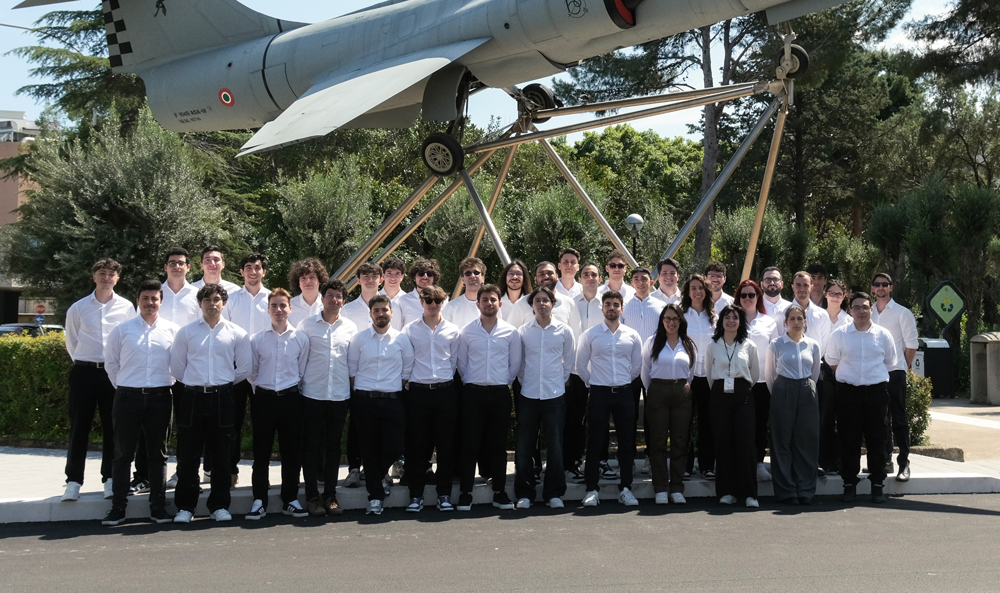

# Apex Corse

  
  
  

---

## Chi Siamo?

Apex Corse è la scuderia dell’Università di Palermo che nasce nel 2023 con lo scopo di progettare e produrre auto da corsa destinate a competere nel campionato internazionale della Formula SAE (Society of Automotive Engineers) contro le migliori università di tutto il mondo.

---

## LA COMPETIZIONE

La Formula SAE, fondata nel 1981 dalla Society of Automotive Engineers, è una competizione internazionale che coinvolge le università e i loro studenti nella creazione di squadre finalizzate alla progettazione di piccole monoposto e la loro valutazione a 360 gradi tramite sfide in pista e non.

---

## TEAM IT

Il team IT è responsabile della progettazione, implementazione e manutenzione dell’infrastruttura informatica del team. Tra le principali attività rientrano la gestione della rete interna, l'amministrazione del sistema NAS per l’archiviazione centralizzata dei dati, la gestione delle licenze software e lo sviluppo di strumenti digitali personalizzati. Inoltre, il team cura l’integrazione di soluzioni automatizzate, come bot Telegram, e contribuisce allo sviluppo di software per l’acquisizione e l’analisi dei dati, supportando operativamente tutti gli altri reparti.

---

## I nostri progetti

- [Volante del veicolo](https://github.com/ApexCorse/steering-wheel)  
- [DataLogger per la telemetria del veicolo](https://github.com/ApexCorse/ephoros)

---

## Membri del Team

<table>
  <tr>
    <td align="center" style="width: 200px; height: 250px; vertical-align: top;">
       
      <a href="https://www.linkedin.com/in/gabriele-salvatore-amorello-808954180/"><strong>Gabriele Amorello</strong></a> 
      <em>Division Manager</em>
    </td>
    <td align="center" style="width: 200px; height: 250px; vertical-align: top;">
       
      <a href="https://www.linkedin.com/in/gabriele-locascio/"><strong>Gabriele Lo Cascio</strong></a> 
      <em>Network & Embedded Engineer</em>
    </td>
  </tr>
  <tr>
    <td align="center" style="width: 200px; height: 250px; vertical-align: top;">
       
      <a href="https://www.linkedin.com/in/antonio-lentini-782419255/"><strong>Antonio Lentini</strong></a> 
      <em>Software & Embedded Engineer</em>
    </td>
    <td align="center" style="width: 200px; height: 250px; vertical-align: top;">
       
      <a href="https://www.linkedin.com/in/francesco-abitabile-689626340/"><strong>Francesco Abitabile</strong></a> 
      <em>Embedded Engineer</em>
    </td>
  </tr>
</table>

